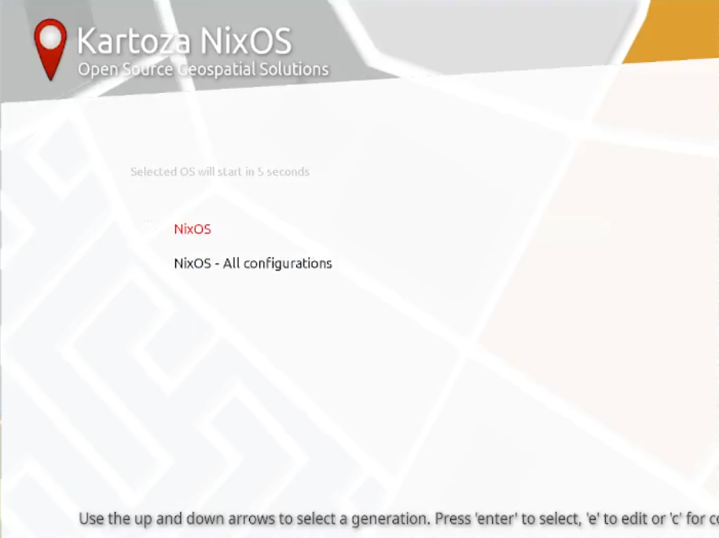
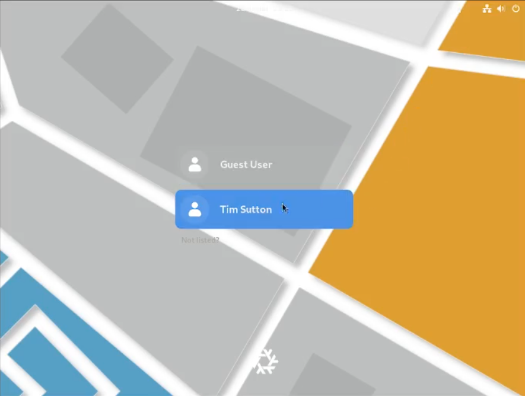
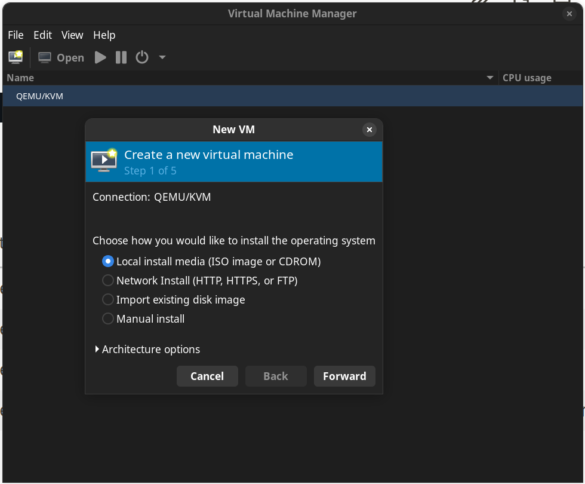
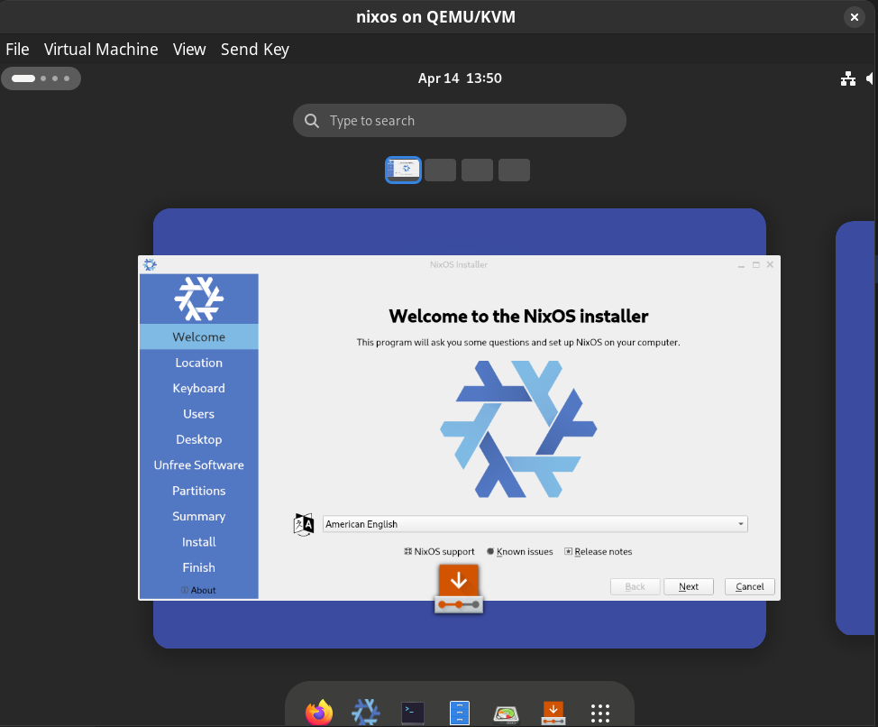

# Tim's Nix Configuration

```
                      ///             
                  ///////////         
                 ////     ////        
                 ///       ///        
                 ////      *//        
              ,,, //// //////////     
           ,,,,,   ////        /////  
          ,,,         ,,,,        /// 
          ,,,       ,,,,  /      //// 
           ,,,,,,,,,,,   ///////////  
              ,,,,           ///* 

██╗  ██╗ █████╗ ██████╗ ████████╗ ██████╗ ███████╗ █████╗             
██║ ██╔╝██╔══██╗██╔══██╗╚══██╔══╝██╔═══██╗╚══███╔╝██╔══██╗            
█████╔╝ ███████║██████╔╝   ██║   ██║   ██║  ███╔╝ ███████║            
██╔═██╗ ██╔══██║██╔══██╗   ██║   ██║   ██║ ███╔╝  ██╔══██║            
██║  ██╗██║  ██║██║  ██║   ██║   ╚██████╔╝███████╗██║  ██║            
╚═╝  ╚═╝╚═╝  ╚═╝╚═╝  ╚═╝   ╚═╝    ╚═════╝ ╚══════╝╚═╝  ╚═╝            
                                                                      
███╗   ██╗██╗██╗  ██╗ ██████╗ ███████╗ 
████╗  ██║██║╚██╗██╔╝██╔═══██╗██╔════╝
██╔██╗ ██║██║ ╚███╔╝ ██║   ██║███████╗
██║╚██╗██║██║ ██╔██╗ ██║   ██║╚════██║
██║ ╚████║██║██╔╝ ██╗╚██████╔╝███████║
╚═╝  ╚═══╝╚═╝╚═╝  ╚═╝ ╚═════╝ ╚══════╝

```

📒 Note: Like most things in life, and in particular in open source, this work
is highly derivative. I tried to credit upstream sources in the various
configuration files provided here whenever possible.

## Background

I started using NixOS in April 2023. I like keeping notes and making my work
repeatable, so NixOS is a good fit for my brain. This repository accumulates
the various things I put onto my computers and is going to be in a state of
continuous evolution. I am co-founder of a company called
[Kartoza](https://kartoza.com). We use NixOS on our linux workstations and 
this repository provides a canonical source of those configurations.

## What this repo provides

It's easier to start with a few screenshots!



This is the boot menu, when you start your computer. From it you can 'roll' back to previous versions of your system before you made your last upgrade. Wait a few seconds and it will simply boot into your system.


This is the boot splash screen. It will show a nice animation of a place marker while the system starts. It will also be here that you enter your disk encryption password. This flake provides all the tools you need to set up your disk with ZFS with encryption enabled.




Once the boot process completes, you will arrive at our custom, Kartoza branded, login screen.


After logging in, your NixOS desktop awaits you! Get productive with the range of developer, GIS and productivity applications we pre-install on each system. Also tools for media creation (like OBS) are set up and ready to use.


We have tried to make every part of the experience great. For example our shell customisations add a Kartoza branded starship bar to your shell prompt. Each system can have its own specific customisation, whilst all of our system enjoy a base line of useful functionality.


[📽️  Here is a walkthrough](https://www.youtube.com/watch?v=s59y0FOUN74) of setting up a VM with Kartoza NixOS.


This repo provides:

1. The flake that I use to set up a number of different systems that I manage.
2. Some custom packages that I use.
3. Many modules which may prove useful for setting up things like zfs, OBS, Headscale and many other niceties.

## Quickstart

I have made a lovely menu / terminal app with all the key functionality provided by this flake:

Running the flake directly from github:

```
nix run --extra-experimental-features nix-command --extra-experimental-features flakes github:timlinux/nix-config
```

Or from a local checkout:

```
nix run .#
```


From here you can perform tasks from the listed sub menus:

### Help documentation


Provides the documentation you are looking at on this page, either as console text or in your web browser.

### System management

Provides tools for configuring your system, starting services, setting up your VPN etc.


### System info

Provides informative diagnostic info for your system.


### Test VMS

Provides test VMs that you can use to try out variants of this flake.


### About


📽️ Please see the [Video Walkthrough](https://youtu.be/kR54Gbr-ZP0) I made of the Utils menu for more details on the above.

## Listing this flake

You can list the flakes like this:

```
nix flake show github:timlinux/nix-config
```

Or if you want to refer to a git branch, add it to the end of the URL e.g. for a branch called 'flakes':

```
nix flake show github:timlinux/nix-config/flakes
```

You will get something like this in the output (most likely changed since I made this screenshot):


## Setting up a new system

If you do not already have a hardware-configuration.nix, you need to either:

* Run the standard NixOS installer on your system, setting up your disks etc,
* Run the zfs command line installer provided in this flake which will scrub your disks and reformat them with zfs. This is the recommended way to set up your system for the first time.

Whether you use option 1 or 2 above, I *highly* recommend that you encrypt your system. Both options above provide easy workflows for doing that.

I have written (based on great examples I found online) a handy dandy setup
script that will completely set up new hosts with ZFS, encrytion, flakes and
various other niceties. You can find this script in
[``packages/setup-zfs-machine/``](packages/setup-zfs-machine/) - check the
[README.md](packages/setup-zfs-machine/README.md) there first as it explains
how to fetch the script when installing to a new maching. Each system added to
this repo should be validated in the table below. Currently validation is
manual, unfortunately.

## Adding a new host to this flake

There are a few steps when adding a new host for the first time:

1. Create the host file
2. Create the user file 
3. Add the host to the flake.nix

### The host file

Create a new host file in hosts e.g.

```
touch hosts/waterfall.nix
```
The newly created file should exactly match the hostname. This starting point for this file is the hardware-configuration.nix that a new nix installation would generate (see the previous section for more info). This file will normally be found in ``/etc/nixos/``.

There are a few edits you need to make to this file to provide:

#### A network id for your ZFS pool

See [this link](https://search.nixos.org/options?channel=unstable&show=networking.. hostId&query=networking.hostId). You can generate a unique host id using this:

```
head -c 8 /etc/machine-id
```

And then place the entry in your <hostname>.nix file. e.g.

```
networking.hostId = "d13e0d41"; # needed for zfs
```
  

#### A hostname

This should exactly match the hostname of your system. For example:


```
networking.hostName = "crest"; # Define your hostname.
```
  

#### Additional imports to defined your desktop environment etc.

The scheme of this flake provides three main types of imports:

1. **configurations** - these are meta collections of components to e.g. set up your desktop environment or a suite of applications.
2. **modules** - these are atomic units of functionality you can add to your system. Many of them will be added though your chosen configuration, but you may choose to add specific modules. For example locale, biometrics etc.
3. **users** - This is a list of one or more users that you want to have accounts on your system.

There is no "one size fits all" here, but a good starting point will be to look at other hosts and copy their config. For example, here is my list of imports for my system which has a fingerprint reader (needs to be a linux supported reader), a Portuguese keyboard and zfs with encryption enabled:

```
  imports = [
    (modulesPath + "/installer/scan/not-detected.nix")
    ../configuration/desktop-gnome.nix
    ../configuration/desktop-apps.nix
    ../modules/locale-pt-en.nix
    ../modules/biometrics.nix
    ../modules/zfs-encryption.nix
    ../modules/unstable-apps.nix # qgis, keepasxc, vscode, uxplay
    ../users/tim.nix
  ];
```

See the next section for more details about the user file.

### The user file

This file should be added into the ``users`` folder if needed. Name the file after the user's name e.g. ``tim.nix``. It is probably easiest to just copy one of the existing users and adapt it.

The users file file configures your user name, home-manager modules and your user groups. For the most part, you can simply copy the existing user file and then replace all instances of the old user name with your user name.


### The flake file

You need to copy in a new entry for your host into ``flake.nix`` e.g.

```
      # Tim headless box
      valley = nixpkgs.lib.nixosSystem {
        specialArgs = specialArgs;
        system = system;
        modules = shared-modules ++ [./hosts/valley.nix];
      };
```

Then replace the comment and shared modules to reference the new host you have created.

### Submitting your change

Finally, your edits to the flake need to be upstreamed to our git repo. Follow normal git workflows for doing that. I recommend adding your host to the existing hosts list in the next section so the expected behaviour for that host is clear.

### Applying the flake to your system

Simply call the script provided in the root of this flake directory to then apply the changes to your system:

```
sudo ./update-system.sh
```

Applying the flake may take some time depending on your internet connection and whether it needs to compile stuff.

Once the installation completes, reboot and you should be experiencing a nice Kartoza branded experience all the way through the boot up and log in process.

If you experience any issues, remember that you can always select a previous generation at the initial start of your system and then boot into your old environment.

## Existing hosts 

### Test

The test environment for NixOS that can be used to 
validate configuration changes etc. The text environment
is created using the `nixos-rebuild build-vm` command and
can be created by running `./vm-test-environment.sh` in
the root of this repo.

You can log in to this test environment using:

User: guest
Pass: guest

| Host | Encryption | Flake | Works | Notes |
|---|---|---|---|----|
| valley | 🟢 | 🔴 | ⛔️ | Encryption not supported, no profile for this.|
| valley | 🔴 | 🔴 | ⛔️ | Encryption not supported, no profile for this. |
| valley | 🟢 | 🟢 | ⛔️ | Encryption not supported, no profile for this.|
| valley | 🔴 | 🟢 | ✔️| | ❤️  Generic install created for testing. |


### Valley 

An i3 Intel NUC that I use as a home server.

| Host | Encryption | Flake | Works | Notes |
|---|---|---|---|----|
| valley | 🟢 | 🔴 | ✔️ | Generic install |
| valley | 🔴 | 🔴 | ✔️ | Generic install |
| valley | 🟢 | 🟢 | ✔️ | ❤️  Production install for home server |
| valley | 🔴 | 🟢 | ⛔️| No profile for this |

### Rock

A VM that you can use to test and experiment with things. To set up the VM,
follow the steps below the table. Unlike the 'test' VM, rock is
intended to be installed on a manually partitioned virtual disk
with ZFS.

|Host | Encryption | Flake | Works| Notes |
|-----|------------|------|------|------| 
|rock| 🟢| 🔴| ✔️| | Generic Install |
|rock| 🔴| 🔴| ✔️| | Generic Install |
|rock| 🟢| 🟢| ✔️ | ❤️  Production install for learning NixOS etc. |
|rock| 🔴| 🟢| ⛔️ | No profile for this |








## Updating flakes

If the flake has been modified in this repo, you can update it like this:

```
nix flake update github:timlinux/nix-config
```

or for a git branch e.g. 'flakes' branch:

```
nix flake update github:timlinux/nix-config/flakes
```

## Other things you can do

### Working with QGIS

#### Choosing a version

There are 3 options for installing QGIS:

1. Install the nix cache stable version - no special setup is needed, just include the ``modules/qgis-stable.nix`` module.
2. Install the nix cache  unstable version - no special setup is needed, just include the ``modules/qgis-unstable.nix`` module. This version is also provided by default in ``modules/unstable-apps.nix`` (see example below). Note that unstable does not speak to the quality of the QGIS release, only to the fact that the package is provided from the Nix unstable repository.
3. Install my custom QGIS version - I have made a custom QGIS build which bundles in extra pythoon packages and gives me a space to 
customise it as wanted. To use it add include the ``modules/qgis-sourcebuild.nix`` module (see example below)


📒 Some notes

1. Option 3 will perform a full source compile which is going to use a bunch of resources on your computer - it could take like an hour or more depending on your processor speed.
2. None of the configurations include QGIS by default so you need to add it to your host - either add it separately to your host/<hostname>.nix depending on which option you prefer, or add the group of unstable apps which will include the qgis-unstable upstream build. Here is an example from my host:


```
  imports = [
    (modulesPath + "/installer/scan/not-detected.nix")
    ../configuration/desktop-gnome-x11.nix
    ../configuration/desktop-apps.nix
    ../modules/locale-pt-en.nix
    ../modules/biometrics.nix
    ../modules/zfs-encryption.nix
    #../modules/unstable-apps.nix # qgis, keepasxc, vscode, uxplay

    # I do it this way so that we use hand compiled QGIS with
    # all the extra goodies I want like pyqtgraph
    # rasterio, debug libs etc. available to the build of QGIS
    # Note that it is mutually exclusive (for now) to the upstream
    # QGIS binaries and also the build may take quite a while on
    # your pc.   If you prefer to use the upstream built binary,
    # you can comment out these next 4 lines and uncomment the
    # unstable-apps entry above.
    ../modules/keepassxc-unstable.nix
    ../modules/vscode-unstable.nix
    ../modules/uxplay-unstable.nix
    ../modules/qgis-sourcebuild.nix
    ../users/tim.nix
  ];
  ```

## The Utils Package

I have written a package called 'utils' which is a starting point for managing your system.


#### Viewing the available python packages

You can view the packages in the QGIS Python console like this:

```
import pkg_resources
 
installed_packages = pkg_resources.working_set
for package in installed_packages:
    print(f"{package.key}=={package.version}")
```

#### Dynamically adding packages


If you want more python packages to be available in your QGIS, you can either modify the custom version as indicated in the section above, or you can use an overlay when launching QGIS like this:

```
nix-shell -p \
  'qgis.override { extraPythonPackages = (ps: [ ps.numpy ps.future ps.geopandas ps.rasterio ]);}' \
  --command "qgis"
```

## Using packages from your own systems

You don't need to directly use this flake to benefit from the packages it defines. Here is an example of how you can use the package:

Save as e.g. ``gverify.nix``

```
{ config, pkgs, ... }:
{
  environment.systemPackages = with pkgs; [
    # Other packages...
    (fetchFromGitHub {
      owner = "timlinux";
      repo = "nix-config";
      # nix-shell -p nix-prefetch-git --command "nix-prefetch-git --url https://github.com/timlinux/nix-config" | grep "hash is"
      rev = "0ah43vmdpjwl6s6vcd1kmfg8srhns5pmzd95a5iwavkn3qjlh4wm";
      # Optionally, you can specify a specific subdirectory
      # subdir = "packages";
    }).gverify  # Replace `packageName` with the actual name of the package you want to include
  ];
}
```

Then in your ``configuration.nix`` add ``gverify.nix`` to your ``imports`` list.


## Resources

I found some resouces particularly valuable in my learning journey, I will try to assemble them here:

1. 📺️ [Chris McDonough's YouTube Channel](https://www.youtube.com/@ChrisMcDonough) - so many great videos that patiently walk through key activities in setting up different aspects of NixOS.
2. 📝 [Determinate Systems Blog](https://determinate.systems/posts) - many interesting and useful hints and tips to get the most out of NixOS.
3. 🎒 [Zero To Nix](https://zero-to-nix.com/) - nice learning resource for those starting out in NixOS.
